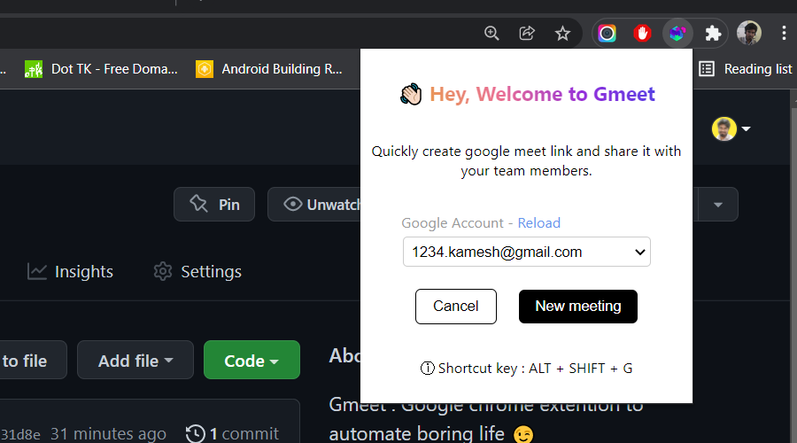

# Gmeet shortcut: makes life easy with automation!
A super cool browser extension that allows you to create a link to a Google Meet meeting in your browser without much effort.

👉🏻 [Demo video @ YouTube](https://youtu.be/Wb6clgENkDo)

## Features
- 🔗 Create a link to a Google Meet meeting through context menu, or keyboard shortcut or extension button
- © Copies the link to the clipboard automatically
- 🧠 Remembers the last account used to create the link

## Installation
- ⬇ Clone this repository and make it in terminal.
- 💨 Run `npm install` to install the extension dependencies
- 💨 Run `npm run build` to build the extension
- 🍞 Go to `chrome://extensions` and click on the "Load unpacked extension" button
- 😎 Now you can use the extension! 🎉